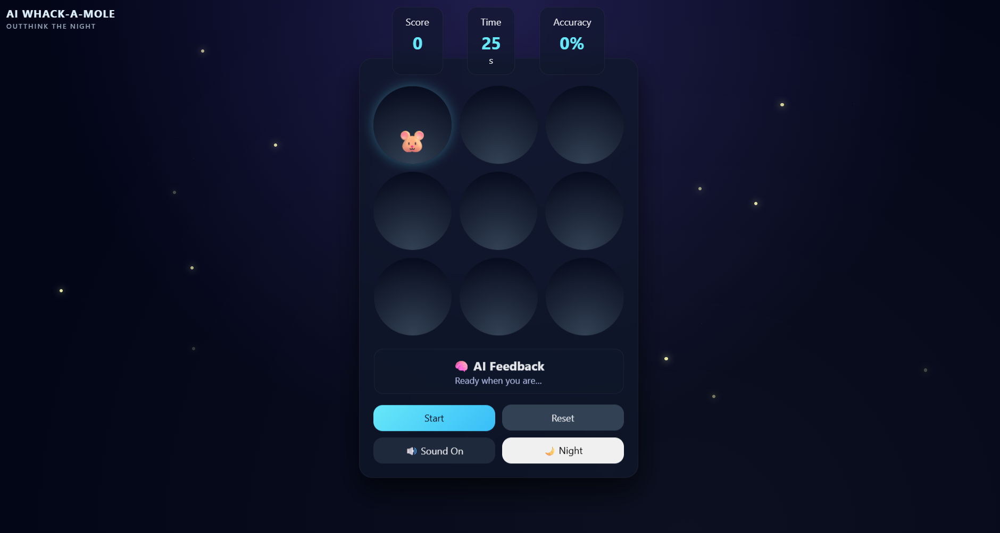

# 🎮 AI Whack-A-Mole

An **AI-powered Whack-A-Mole game** with adaptive difficulty, immersive sound design, and a mystic night theme.  
Built using **HTML, CSS, and Vanilla JavaScript** — no frameworks.

---

## ✨ Features

- 🤖 **AI-Driven Difficulty**
  - Game adjusts mole speed based on player performance
  - Balanced to respect human reaction time

- 🐹 **Responsive Gameplay**
  - Reliable hit detection
  - No late-game input loss (token-based fix for timing issues)

- 🌙 **Mystic Night UI**
  - Glassmorphism design
  - Fog, fireflies, and subtle star noise
  - Dark / Moonlight theme toggle

- 🔊 **Sound Design**
  - Background ambience
  - Hit, miss, button, and game-over sounds
  - Mute toggle

- 🏆 **End-Screen Summary**
  - Final score
  - Accuracy
  - AI feedback message
  - Play-again option

- 💾 **Best Score Saved**
  - Stored using `localStorage`
  - Persists across browser refreshes

---

## 🕹️ Controls

| Action | Input |
|------|------|
| Hit mole | Mouse click |
| Start game | Start button |
| Reset | Reset button |
| Toggle sound | Mute button |
| Toggle theme | Night / Moonlight button |

---

## 🧠 How the AI Works

The AI periodically analyzes:
- Score
- Hits vs misses
- Accuracy

Based on this data, it **suggests difficulty changes**.  
The game engine then applies these changes safely using **bounded reaction-time limits**.

> The AI influences the game — it does not unfairly control it.

---

## 🛠️ Tech Stack

- **HTML5** — structure
- **CSS3** — animations, layout, glass UI
- **JavaScript (ES6)** — game logic & AI interaction
- **LocalStorage** — persistent best score

No libraries. No frameworks.

---

## 🚀 Run Locally

1. Clone the repository
   ```bash
   git clone https://github.com/your-username/ai-whack-a-mole.git
Open index.html in your browser
(No server required)

## 📸 Preview




## 🎓 Learning Outcomes
Game state management

Timing & race-condition handling

UI/UX layering (HUD vs gameplay)

Performance-based difficulty scaling

Clean JavaScript architecture

## 📄 License
This project is open-source and available under the MIT License.

## 🙌 Author
Built with focus on game feel, fairness, and clean design.
If you enjoyed this project, feel free to ⭐ the repo!


